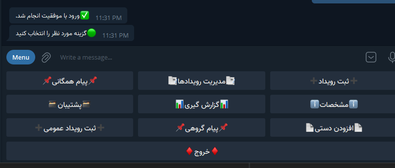
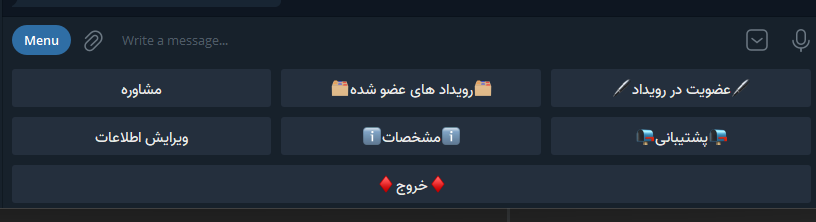
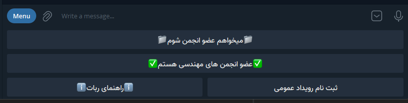

# BECtelegrambot
A Telegram Bot using Telepot library and SQLite3 for managing a group

Admins can create new events (which have types, like sport event or an educational event) events can be free
or cost some charge, the admin will approve when someone has correctly paid the charge 
Admins can show the list of events and remove each or show it

They can send a group message or a send-to-all message

They can get excel export of data (events and who signed in, Users , Admins , ...)

They can get Backup from data

They can add data directly from excel file (manual addition)

## Admin Panel

## Normal user Panel

A normal user can participate in an event, pay charges if they need to be paid, get the list of events and remove or show them

They can get consult and advice from our admins in different subjects or enter the group for that subject

They can talk to backup-service , and finally they can change their data (like phone number and melliCode)

## First Menu
You can sigin in or sign up or sign up in an event which doesn't require membership , and get the Bot help pdf file

